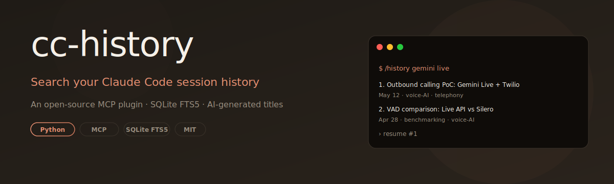
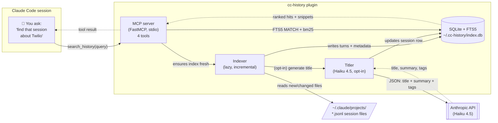

<p align="center">
  
</p>

<h1 align="center">cc-history — Search your Claude Code session history</h1>

<p align="center">
  <strong>A Claude Code plugin that turns your local <code>~/.claude/projects/</code> JSONL files into a searchable, named corpus — find, read, and resume past sessions from inside any Claude Code conversation.</strong>
</p>

<p align="center">
  Ask Claude <em>"find that session where we figured out the Twilio bridge for Gemini Live"</em> and it surfaces a ranked list with human-readable titles, AI summaries, and a paste-ready <code>claude --resume</code> command. No web UI. No tab switching. Search becomes a conversation.
</p>

<p align="center">
  <a href="https://www.python.org/downloads/"></a>
  <a href="https://modelcontextprotocol.io/"></a>
  <a href="https://docs.claude.com/en/docs/claude-code/plugins"></a>
  <a href="https://www.sqlite.org/fts5.html"></a>
  <a href="LICENSE"></a>
  
  
</p>

<p align="center">
  <a href="#-quick-start"><strong>Install in 2 minutes →</strong></a>
  &nbsp;·&nbsp;
  <a href="#-how-it-feels-to-use">How it feels</a>
  &nbsp;·&nbsp;
  <a href="#%EF%B8%8F-architecture">Architecture</a>
  &nbsp;·&nbsp;
  <a href="#-mcp-tools">MCP tools</a>
  &nbsp;·&nbsp;
  <a href="#-privacy">Privacy</a>
</p>

---

## ✨ The problem

Claude Code stores every conversation as a JSONL file under `~/.claude/projects/<project-slug>/<uuid>.jsonl`. After a few weeks of heavy use you have hundreds of sessions named like `1780bae5-8773-4614-b276-8f795477d43a.jsonl` and **no way to find anything**.

Native `claude --resume` only lists recent sessions, with no titles, no search, no cross-project view. If you remember "we figured this out last month" — good luck finding it.

`cc-history` fixes that. It's a Claude Code plugin that indexes your entire local session history into a SQLite FTS5 full-text index, generates a human-readable title + summary for each session using Claude Haiku (opt-in), and exposes everything as conversational MCP tools — so you ask Claude to find old work the way you'd ask a colleague.

---

## 🎬 How it feels to use

```text
You (inside any Claude Code session):
  > find the session where I was building the outbound calling PoC

Claude (calls cc-history.search_history):
  Found 3 matches:

  1. Outbound calling PoC: Gemini Live + Twilio bridge — May 12
     Architecture for AI marketing calls; explored Indian DLT compliance.
     [voice-AI · telephony · compliance]

  2. Twilio number provisioning for Indian numbers — Apr 30
     DLT registration steps; chose Plivo as alternative.

  3. Real-time STT comparison for telephony — Apr 19
     Cost/latency analysis; picked Gemini Live.

You:
  > resume #1

Claude (calls cc-history.get_resume_command):
  Copy this into a fresh terminal tab:
    cd /Users/you/Desktop/AI-Counsellor && claude --resume 1780bae5-...
```

The first time you install, indexing your entire history takes about a second per 100 sessions. After that, every search is instant.

---

## 🚀 Features

- 🔍 **Cross-project full-text search** — SQLite FTS5 with bm25 ranking across every session in `~/.claude/projects/`
- 🤖 **AI-generated session titles** — one Claude Haiku call per session turns hex UUIDs into readable journal entries (~$0.001 per session, cached forever, opt-in)
- 💬 **Conversational interface** — exposed as 4 MCP tools, so you ask Claude in plain English instead of remembering CLI flags
- ⚡ **5 slash commands** — `/history`, `/history-recent`, `/history-reindex`, `/history-retitle`, `/history-reset`
- 🔁 **One-click resume** — get a paste-ready `cd <project> && claude --resume <id>` command for any past session
- 📂 **Local-first, zero telemetry** — your sessions never leave your disk except the optional Haiku title call (clearly disclosed, controllable by env var)
- 🪶 **Lazy incremental indexing** — no daemon, no file watcher; only re-parses JSONL files whose mtime changed
- 🛡️ **Malformed-JSONL tolerant** — survives broken lines mid-stream (production CC sessions sometimes have these)
- 🐍 **One Python package** — distributed via `uvx`, installed via the official Claude Code `/plugin install` flow
- 🧪 **42 passing tests** — TDD throughout, fixtures matching real CC JSONL shape

---

## ⚡ Quick start

Get running in under 2 minutes:

```bash
# 1. Make sure uv is installed (the plugin uses uvx to spawn the MCP server)
curl -LsSf https://astral.sh/uv/install.sh | sh

# 2. Add this plugin as a Claude Code marketplace
/plugin marketplace add thegauravmahto/claude-code-history

# 3. Install the plugin
/plugin install cc-history@claude-code-history

# 4. (Optional) Enable AI-generated session titles
export ANTHROPIC_API_KEY=sk-ant-...     # cost: ~$0.001 per session, one-time
```

Restart Claude Code, open any session, and ask:

> *"find that session where I was figuring out X"*

Or use a slash command:

```text
/history gemini live
```

The first invocation indexes your history (typically 1-3 seconds for hundreds of sessions). Subsequent calls are instant.

---

## 🏛️ Architecture



The plugin is a stdio MCP server spawned by Claude Code via `uvx cc-history-mcp`. Every tool call runs the indexer first — it walks `~/.claude/projects/` and re-indexes only files whose mtime exceeds the last indexed mtime (so the first call is the slow one; everything after is instant).

The SQLite database lives at `${CLAUDE_PLUGIN_DATA}/index.db` (typically `~/.cc-history/index.db` outside the plugin sandbox). FTS5 with the Porter stemmer + Unicode tokenizer handles fuzzy matching; `bm25(turns_fts)` ranks hits.

AI title generation is optional and lazy — it runs as part of indexing only when `ANTHROPIC_API_KEY` is set. Each session's first user message + first assistant response are sent to Haiku 4.5 in a tightly-scoped prompt that returns JSON: `{title, summary, tags}`. Results are cached in the DB forever; re-titling is a deliberate user action via `/history-retitle`.

---

## 🛠️ Tech stack

### Core

| Component | Detail |
|-----------|--------|
| Language | Python 3.11+ |
| MCP SDK | `mcp >= 1.2.0` (FastMCP) |
| LLM SDK | `anthropic >= 0.40.0` (titler only, optional) |
| Storage | Stdlib `sqlite3` with FTS5 virtual tables |
| Build | `hatchling` |
| Distribution | `uvx` / PyPI |

### Plugin surface

| Component | What it is |
|-----------|------------|
| `.claude-plugin/plugin.json` | Plugin manifest (name, version, author) |
| `.mcp.json` | Spawns the MCP server via `uvx cc-history-mcp` |
| `commands/*.md` | 5 slash commands (Markdown skills) |
| `src/cc_history/server.py` | FastMCP server with 4 tools |

### Indexing pipeline

| Module | Responsibility |
|--------|----------------|
| `jsonl_parser.py` | Parses Claude Code JSONL into typed `Turn` / `Session` objects, tolerates malformed lines |
| `slug.py` | Bidirectional conversion between Claude's `-Users-name-Path` slug and `/Users/name/Path` |
| `db.py` | SQLite schema + FTS5 virtual table + upsert helpers |
| `indexer.py` | Walks `~/.claude/projects/`, incrementally indexes by mtime |
| `titler.py` | Builds the Haiku prompt, parses JSON, retries gracefully on failure |
| `search.py` | FTS5 query builder, `list_recent`, raw session reads, resume-command builder |

---

## 🔧 MCP tools

The plugin exposes 4 tools that Claude Code can call from any session:

<details>
<summary><strong><code>search_history(query, limit?, project?, since_days?)</code></strong></summary>

Full-text search across all indexed sessions. Returns ranked hits with FTS5-highlighted snippets, AI titles, summaries, and tags.

| Argument | Type | Default | Description |
|----------|------|---------|-------------|
| `query` | string | required | FTS5 query syntax OR plain prose — the server tolerates both |
| `limit` | int | 5 | Max results (1-20) |
| `project` | string | — | Substring filter on project path |
| `since_days` | int | — | Only sessions started in the last N days |

</details>

<details>
<summary><strong><code>get_session(session_id, include_tool_calls?, max_turns?)</code></strong></summary>

Read a single session turn-by-turn from the original JSONL file (the FTS index is search-only — full reads go to disk).

| Argument | Type | Default | Description |
|----------|------|---------|-------------|
| `session_id` | string | required | UUID (or filename stem) |
| `include_tool_calls` | bool | false | (Reserved for v1.1) |
| `max_turns` | int | 200 | Safety cap |

</details>

<details>
<summary><strong><code>list_recent(days?, project?)</code></strong></summary>

Sessions started within the last N days, ordered newest first.

| Argument | Type | Default | Description |
|----------|------|---------|-------------|
| `days` | int | 7 | Window size (1-90) |
| `project` | string | — | Substring filter |

</details>

<details>
<summary><strong><code>get_resume_command(session_id)</code></strong></summary>

Returns a paste-ready shell command:

```json
{
  "command": "cd /Users/you/Projects/foo && claude --resume 1780bae5-...",
  "project_path": "/Users/you/Projects/foo",
  "session_title": "Outbound calling PoC: Gemini Live + Twilio bridge"
}
```

</details>

---

## ⌨️ Slash commands

| Command | What it does |
|---------|--------------|
| `/history <query>` | Search across all sessions, top 5 results |
| `/history-recent [days]` | Recent sessions (default 7 days) grouped by project |
| `/history-reindex` | Force a full reindex — useful after first setting `ANTHROPIC_API_KEY` |
| `/history-retitle <id>` | Regenerate the AI title for one session (v1.1 — currently surfaces guidance) |
| `/history-reset` | Wipe the index DB and rebuild from scratch |

---

## 🔒 Privacy

- **Session data never leaves your machine.** Indexing reads JSONL files locally; the SQLite DB is local.
- **One optional outbound call:** title generation calls the Anthropic API with the first few turns of each session, only when `ANTHROPIC_API_KEY` is set. Disable it by unsetting the env var — the rest of the plugin works without titles.
- **No telemetry, no analytics, no phone-home.** Verify by reading [`src/cc_history/server.py`](src/cc_history/server.py) — `Anthropic` is only imported inside the `main()` entry point and only when the API key exists.

---

## 💰 Cost

The plugin itself is free and open source. The only optional cost is Haiku title generation:

| Sessions | One-time cost (USD) |
|----------|---------------------|
| 50 | ~$0.05 |
| 200 | ~$0.20 |
| 500 | ~$0.50 |
| 1000 | ~$1.00 |

Costs are one-time per session — titles are cached in SQLite forever. Re-titling is a deliberate action via `/history-retitle`.

---

## 🧪 Development

```bash
# Clone + install
git clone https://github.com/thegauravmahto/claude-code-history.git
cd claude-code-history
uv venv && source .venv/bin/activate
uv pip install -e ".[dev]"

# Run the test suite (42 tests, ~0.5s)
pytest -v

# Index your real history into a scratch DB
python -c "
from pathlib import Path
import os
from cc_history.db import open_db
from cc_history.indexer import index_all
conn = open_db(Path('/tmp/cc-scratch.db'))
print(index_all(conn, Path(os.path.expanduser('~/.claude/projects'))))
"

# Build the wheel
uv build
```

The plan and spec live in [`docs/superpowers/`](docs/superpowers/) — the entire build was done with [Anthropic's superpowers plugin](https://github.com/anthropics/skills) using brainstorming → writing-plans → subagent-driven-development.

---

## 🗺️ Roadmap

v1 ships search + AI titles + 4 MCP tools + 5 slash commands.

Candidates for v1.1+, ranked by user-value-per-effort:

- 🌐 **Local web UI** — for browsing/reading sessions with chat-bubble rendering, syntax-highlighted code blocks, and "resume here" buttons
- 🧠 **Semantic search** — sentence-transformers or Voyage embeddings for paraphrased queries
- ⭐ **Bookmark / star sessions** — personal hall of fame
- 📅 **"This week" digest** — auto-summary of what you worked on
- 📤 **Export as Markdown** — share a session as a clean MD file
- 🎯 **Per-project profiles** — pin AI title prompts per project context

Open an issue to vote or propose.

---

## 🤝 Contributing

PRs welcome. The codebase is small (~800 LoC), tightly tested, and intentionally boring. Each module has a single responsibility — read `docs/superpowers/specs/2026-05-27-cc-history-plugin-design.md` for the design rationale and `docs/superpowers/plans/2026-05-27-cc-history.md` for the TDD task breakdown.

If you find a real JSONL session that breaks the parser, open an issue with a sanitized excerpt — robustness against the wild shape of `~/.claude/projects/` is the most valuable contribution.

---

## 📄 License

MIT — see [LICENSE](LICENSE).

---

## 🏷️ Tags

`claude-code` · `claude-code-plugin` · `mcp` · `mcp-server` · `anthropic` · `claude-ai` · `model-context-protocol` · `sqlite-fts5` · `developer-tools` · `cli` · `python` · `session-history` · `search` · `conversational-search` · `local-first`
